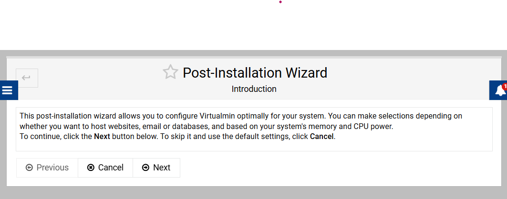

# LinuxServerForDotNetApps
scripts to setup an ubuntu linux server to run dotnet apps

Install progress with external access

# Download the script
wget https://raw.githubusercontent.com/egarim/LinuxServerForDotNetApps/refs/heads/main/setup_postgres.sh?token=GHSAT0AAAAAAC56EANKOKGRL4KNMSNSG45E2DX66JA -O setup_postgres.sh

# Make it executable
chmod +x setup_postgres.sh

# Run the script
./setup_postgres.sh

## or a single line

# curl
sudo bash -c "$(curl -fsSL 'https://raw.githubusercontent.com/egarim/LinuxServerForDotNetApps/refs/heads/main/setup_postgres.sh?token=GHSAT0AAAAAAC56EANKOKGRL4KNMSNSG45E2DX66JA')"

# wget
sudo bash -c "$(wget -qO- 'https://raw.githubusercontent.com/egarim/LinuxServerForDotNetApps/refs/heads/main/setup_postgres.sh?token=GHSAT0AAAAAAC56EANKOKGRL4KNMSNSG45E2DX66JA')"

# Virtualmin for webhosting

sudo sh -c "$(curl -fsSL https://software.virtualmin.com/gpl/scripts/virtualmin-install.sh)" -- --bundle LAMP

Select both postgress and MariaDb

Set a password

Skip

setup an email to get notifications

Finish the configuration

Store plain text

Keep default

Per domain

Done