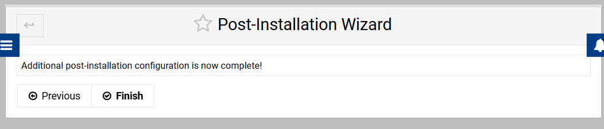

# Linux Server For .NET Applications

A collection of scripts to set up an Ubuntu Linux server optimized for running .NET applications.

## PostgreSQL Setup

Use either of the following commands to install and configure PostgreSQL on your server:

### Using curl
```bash
sudo bash -c "$(curl -fsSL https://raw.githubusercontent.com/egarim/LinuxServerForDotNetApps/main/setup_postgres.sh)"
```

### Using wget
```bash
sudo bash -c "$(wget -qO- https://raw.githubusercontent.com/egarim/LinuxServerForDotNetApps/main/setup_postgres.sh)"
```

## Virtualmin for Webhosting

Install Virtualmin with LAMP bundle using the following command:

```bash
sudo sh -c "$(curl -fsSL https://software.virtualmin.com/gpl/scripts/virtualmin-install.sh)" -- --bundle LAMP
```

### Installation Steps

1. **Server Setup**  
   

2. **Email Domain Lookup Server**  
   

3. **Virus Scanning**  
   Enable virus scanning with ClamAV  
   

4. **Database Servers**  
   Select both PostgreSQL and MariaDB  
   

5. **MariaDB Password**  
   Set a secure password  
   

6. **DNS Configuration**  
   Skip this step  
   

7. **System Email Address**  
   Set up an email address to receive notifications  
   

8. **Complete Setup**  
   Finish the configuration  
   

9. **Password Storage**  
   Choose to store passwords in plain text  
   

10. **MariaDB Database Size**  
    Keep default settings  
    

11. **SSL Key Directory**  
    Select "Per domain" option  
    

12. **Installation Complete**  
    Setup is now complete  
    

## Remote MySQL/MariaDB Access

Configure your MySQL/MariaDB server for remote access using one of the following methods:

### Using curl
```bash
sudo bash -c "$(curl -fsSL https://raw.githubusercontent.com/egarim/LinuxServerForDotNetApps/main/mysqlremoteaccess.sh)"
```

### Using wget
```bash
sudo bash -c "$(wget -qO- https://raw.githubusercontent.com/egarim/LinuxServerForDotNetApps/main/mysqlremoteaccess.sh)"
```

## Install libgdiplus for .NET Applications

Install the libgdiplus library which is required by System.Drawing in .NET applications:

### Using curl
```bash
sudo bash -c "$(curl -fsSL https://raw.githubusercontent.com/egarim/LinuxServerForDotNetApps/main/install_libgdiplus.sh)"
```

### Using wget
```bash
sudo bash -c "$(wget -qO- https://raw.githubusercontent.com/egarim/LinuxServerForDotNetApps/main/install_libgdiplus.sh)"
```


# Linux Service Deployment Script

## Overview

The `deploy-service.sh` script automates the deployment of applications as Linux systemd services. It handles the complete deployment pipeline from packaging your local application to running it as a service on a remote Linux server.

## What the Script Does

The deployment process consists of the following automated steps:

1. **Configuration Loading** - Reads deployment settings from a JSON configuration file
2. **SSH Connection Testing** - Verifies connectivity to the target server (optional)
3. **Application Packaging** - Creates a zip archive of your local application directory
4. **File Upload** - Transfers the packaged application to the remote server via SCP
5. **Remote Deployment** - Extracts files, sets permissions, and configures the application
6. **Service Creation** - Generates and installs a systemd service file
7. **Service Management** - Enables and starts the service automatically
8. **Verification** - Shows the service status to confirm successful deployment

## Prerequisites

### Local Environment (WSL/Linux)
- WSL2 or Linux environment
- `zip` package installed (`sudo apt-get install zip`)
- SSH client configured
- `jq` package (optional, for better JSON parsing)

### Remote Server
- Ubuntu/Debian Linux server
- SSH access with sudo privileges
- `unzip` and `systemd` installed (standard on most distributions)

### Authentication
Choose one of the following authentication methods:
- **SSH Key Authentication** (recommended): Set up SSH keys for passwordless access
- **Password Authentication**: Use username/password (will prompt during deployment)

## Configuration File (deploy-config.json)

Create a `deploy-config.json` file in the same directory as the deployment script:

```json
{
  "LocalDirectory": "./publish",
  "ServerHost": "your-server.com",
  "Username": "root",
  "ServiceName": "MyApplication",
  "ExecutablePath": "MyApp.exe",
  "RemoteDirectory": "/opt/myapp",
  "ServiceDescription": "My Application Service",
  "ServiceUser": "root",
  "UsePassword": false
}
```

### Configuration Parameters

| Parameter | Type | Required | Description | Example |
|-----------|------|----------|-------------|---------|
| `LocalDirectory` | string | ✅ | Path to local application directory | `"./publish"`, `"/home/user/myapp"` |
| `ServerHost` | string | ✅ | Remote server hostname or IP address | `"server.example.com"`, `"192.168.1.100"` |
| `Username` | string | ✅ | SSH username for remote server | `"root"`, `"ubuntu"`, `"deploy"` |
| `ServiceName` | string | ✅ | Name for the systemd service | `"mywebapi"`, `"background-worker"` |
| `ExecutablePath` | string | ✅ | Path to executable relative to remote directory | `"myapp.exe"`, `"bin/start.sh"` |
| `RemoteDirectory` | string | ❌ | Target directory on remote server | `"/opt/myapp"`, `"/home/user/apps/myapp"` |
| `ServiceDescription` | string | ❌ | Description shown in systemd | `"My Web API Service"` |
| `ServiceUser` | string | ❌ | User account to run the service | `"root"`, `"www-data"`, `"myapp"` |

### Default Values

- `RemoteDirectory`: `/opt/{ServiceName}`
- `ServiceDescription`: `"Auto-deployed service"`
- `ServiceUser`: `"root"`

### Configuration Example

#### .NET Application
```json
{
  "LocalDirectory": "./bin/Release/net8.0/publish",
  "ServerHost": "api.mycompany.com",
  "Username": "deploy",
  "ServiceName": "mywebapi",
  "ExecutablePath": "MyWebApi",
  "RemoteDirectory": "/opt/mywebapi",
  "ServiceDescription": "My Company Web API",
  "ServiceUser": "www-data"
}
```

## Usage

### Basic Usage
```bash
# Make script executable
chmod +x deploy-service.sh

# Deploy using default config file (deploy-config.json)
./deploy-service.sh
```

### Command Line Options
```bash
# Use custom config file
./deploy-service.sh --config my-config.json

# Override specific parameters
./deploy-service.sh --host different-server.com --service new-name

# Skip SSH connection test
./deploy-service.sh --skip-test

# Deploy with command line parameters only
./deploy-service.sh \
  --local ./publish \
  --host server.com \
  --user root \
  --service myapp \
  --exec myapp.exe \
  --remote /opt/myapp
```

### Available Command Line Options

| Short | Long | Description |
|-------|------|-------------|
| `-c` | `--config` | Configuration file path |
| `-l` | `--local` | Local directory |
| `-h` | `--host` | Server hostname |
| `-u` | `--user` | SSH username |
| `-s` | `--service` | Service name |
| `-e` | `--exec` | Executable path |
| `-r` | `--remote` | Remote directory |
| `-d` | `--desc` | Service description |
| | `--service-user` | Service user account |
| | `--skip-test` | Skip SSH connection test |
| | `--help` | Show help message |

## Generated systemd Service

The script automatically creates a systemd service file at `/etc/systemd/system/{ServiceName}.service`:

```ini
[Unit]
Description=My Application Service
After=network.target

[Service]
Type=simple
User=root
WorkingDirectory=/opt/myapp
ExecStart=/opt/myapp/myapp.exe
Restart=always
RestartSec=10

[Install]
WantedBy=multi-user.target
```

## Post-Deployment Management

After successful deployment, you can manage your service using standard systemd commands:

```bash
# Check service status
sudo systemctl status myapp

# View logs
sudo journalctl -u myapp -f

# Stop service
sudo systemctl stop myapp

# Start service
sudo systemctl start myapp

# Restart service
sudo systemctl restart myapp

# Disable service (prevent auto-start)
sudo systemctl disable myapp

# Enable service (auto-start on boot)
sudo systemctl enable myapp
```

## Troubleshooting

### Common Issues

**SSH Connection Failed**
- Verify hostname/IP address is correct
- Check if SSH service is running on target server
- Ensure username and authentication method are correct
- Try connecting manually: `ssh username@hostname`

**Permission Denied**
- Check SSH credentials
- Verify user has sudo privileges on target server
- For SSH keys: ensure key is added to ssh-agent

**Service Won't Start**
- Check service logs: `sudo journalctl -u servicename -n 50`
- Verify executable path is correct
- Ensure all dependencies are installed on target server
- Check file permissions

**File Upload Failed**
- Verify disk space on target server
- Check network connectivity
- Ensure `/tmp` directory is writable

### Debug Mode

Add `set -x` to the script for verbose output:
```bash
# Edit the script temporarily
sed -i '2i set -x' deploy-service.sh
./deploy-service.sh
```

## Security Considerations

- Use SSH key authentication instead of passwords when possible
- Run services with dedicated user accounts (not root) when feasible
- Regularly update and patch target servers
- Review and limit sudo privileges for deployment accounts
- Consider using dedicated deployment keys with restricted permissions

## File Structure After Deployment

```
/opt/myapp/                 # Remote directory
├── myapp.exe              # Your application files
├── appsettings.json       # (example)
├── wwwroot/               # (example)
└── ...                    # All files from LocalDirectory

/etc/systemd/system/
└── myapp.service          # Generated service file

/var/log/                  # Service logs via journald
```
